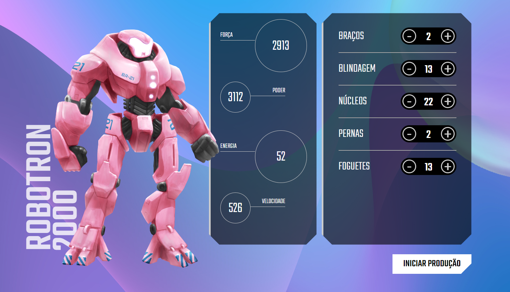

<h4 align="center"> 
	🚧  Robotron2000 📚 Concluído ✅ 🚧
</h4>

 <a href="#-sobre">Sobre</a> •
 <a href="#-layout">Layout</a> • 
 <a href="#-tecnologias">Tecnologias</a> • 
 <a href="#-autora">Autora</a>

## 📋 Sobre

Trata-se da construção de uma página dinâmica através da manipulação de dados, eventos, elementos e declaração de funções. 

Desenvolvido durante o curso destinado à **JavaScript para Front-End** da [Alura](https://cursos.alura.com.br/).

---

### 💻 Layout 

   
  
---

## 🛠 Tecnologias

As seguintes ferramentas foram usadas na construção do projeto:
-   **[JavaScript](https://developer.mozilla.org/)**
-   **[CSS3](https://developer.mozilla.org/)**
-   **[HTML5](https://developer.mozilla.org/)**

---

## 👩‍💻 Autora

Feito com ❤️ por Joyce Heinze 👋🏽 [Entre em contato!](mailto:joyceheinze@ufrrj.br)

